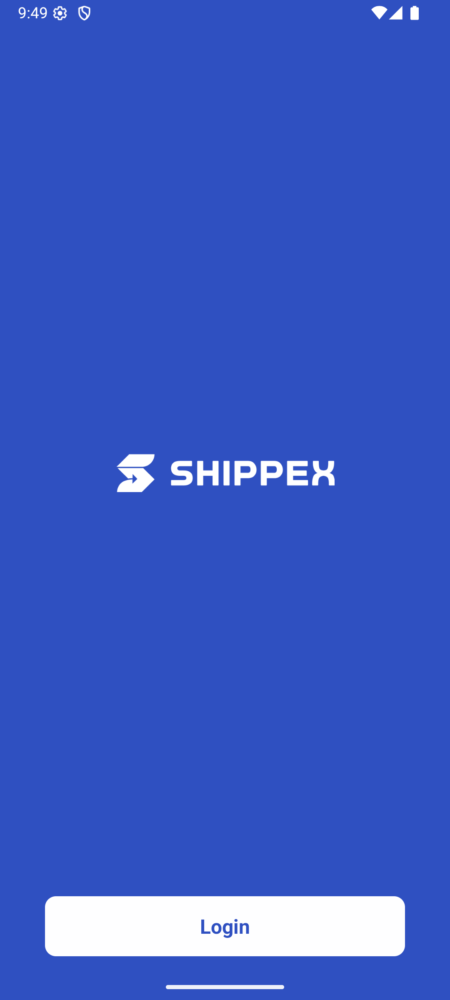
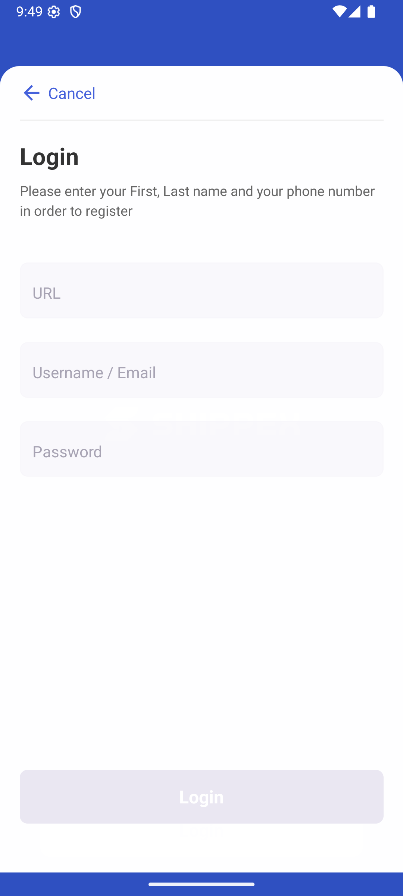
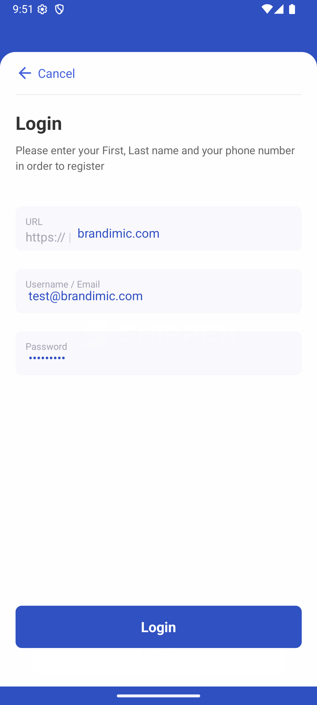
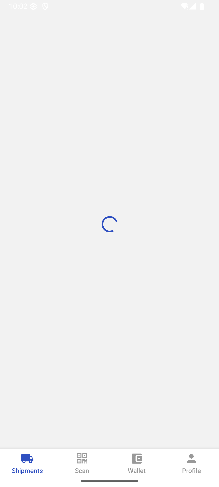
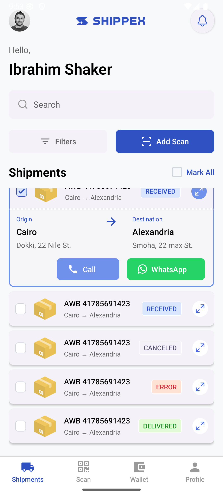
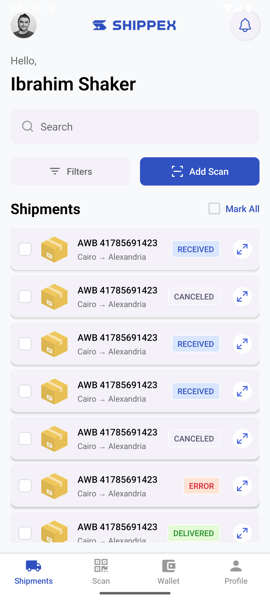
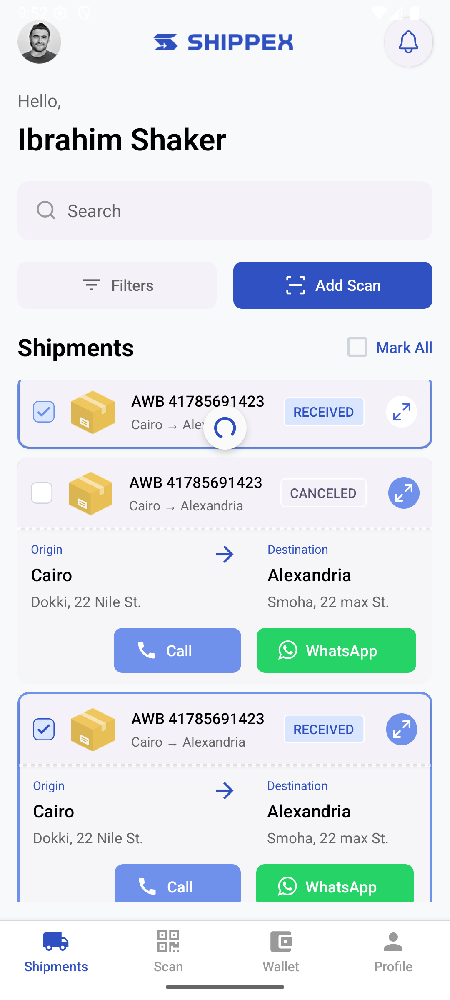

# Shipment App

A React Native mobile application that allows drivers to manage and track their shipment status.

## Overview

This Shipment Tracker app features:

- Animated splash screen
- User authentication
- Shipment listing with status indicators
- Pull-to-refresh functionality

## Screenshots

|                   Splash Screen                    |                    Splash1 Screen                    |                         Blue                         |                      Login                       |                      LoginModal                      |                         LoginModalFilled                         |                   Loader Screen                    |                  Shipments Screen                  |                        ShipmentsScreen                         |                       ShipmentItems                        |
| :------------------------------------------------: | :--------------------------------------------------: | :--------------------------------------------------: | :----------------------------------------------: | :--------------------------------------------------: | :--------------------------------------------------------------: | :------------------------------------------------: | :------------------------------------------------: | :------------------------------------------------------------: | :--------------------------------------------------------: |
|  |  |  |  |  |  |  |  |  |  |

## Tech Stack

- React Native
- TypeScript
- React Navigation
- React Native Reanimated
- React Native Splash Screen

## Features

### Implemented Features

- **Splash Screen:** Animated introduction screen based on Figma design
- **Login Screen:**
  - Form validation
  - Animations as specified in design
  - Username/email and password fields
- **Shipment List Screen:**
  - Display of shipments with status indicators (Received, Canceled, etc.)
  - Implementation using FlatList
  - Pull-to-refresh functionality

## Installation

### Prerequisites

- Node.js >= 14.0.0
- JDK >= 11 (for Android)
- Android Studio (for Android development)
- Xcode (for iOS development)
- CocoaPods (for iOS dependencies)

### Setup

1. Clone the repository:

   ```sh
   git clone https://github.com/banjo09/shipment.git
   cd shipment
   ```

2. Install dependencies:

   ```sh
   npm install
   # OR
   yarn install
   ```

3. For iOS, install CocoaPods dependencies:
   ```sh
   bundle install
   bundle exec pod install
   ```

## Running the App

### Start Metro Server

```sh
# Using npm
npm start
# OR using Yarn
yarn start
```

### Run on Android

```sh
# Using npm
npm run android
# OR using Yarn
yarn android
```

### Run on iOS

```sh
# Using npm
npm run ios
# OR using Yarn
yarn ios
```

## Building APK

To build a release APK:

```sh
cd android
./gradlew assembleRelease
```

The APK will be generated at `android/app/build/outputs/apk/release/app-release.apk`

## Project Structure

```
shipment/
├── android/              # Android native code
├── ios/                  # iOS native code
├── src/
│   ├── assets/           # Images, fonts, etc.
│   │   ├── images/       # Image files
│   │   └── screenshots/  # Screenshots images
│   ├── components/       # Reusable components
│   ├── navigation/       # Navigation configuration
│   ├── screens/          # Screen components
│   ├── services/         # API services
│   ├── types/            # TypeScript type definitions
│   └── utils/            # Utility functions
├── App.tsx               # Root component
├── index.js              # Entry point
└── README.md             # Project documentation
```

## Development

### Code Style

This project follows the [TypeScript ESLint](https://typescript-eslint.io/) rules.

To check linting:

```sh
npm run lint
# OR
yarn lint
```

### Testing

Run tests with:

```sh
npm test
# OR
yarn test
```

## API Integration

The app integrates with [API details if applicable].
This app integrates with the Shippex API, a shipment management system built on the Frappe framework. The following endpoints are used:

1. Login API

Method: POST
Endpoint: https://shippex-demo.bc.brandimic.com/api/method/login
Body (form-data):

usr: User email (e.g., test@brandimic.com)
pwd: User password (e.g., testy123@)

Purpose: Authenticates users and returns session tokens required for subsequent API calls

2. Shipment Status List API

Method: GET
Endpoint: https://shippex-demo.bc.brandimic.com/api/method/frappe.client.get_list
Body (form-data):

doctype: "AWB Status"
fields: ["*"]

Purpose: Fetches all possible shipment statuses (Received, Canceled, etc.)

3. Shipment List API

Method: GET
Endpoint: https://shippex-demo.bc.brandimic.com/api/method/frappe.client.get_list
Body (raw JSON):
jsonCopy{
"doctype": "AWB",
"fields": ["*"],
"filters": {
"name": ["like", "%search_term%"]
}
}

Purpose: Retrieves shipments (Air Waybills) with optional filtering by name/ID

### API Usage Notes

Authentication is required before accessing any other endpoints
The app maintains session tokens and refreshes them when needed
All API responses are handled with proper error management
Shipment data is cached locally for offline access when possible

## Contributing

1. Fork the repository
2. Create your feature branch: `git checkout -b feature/my-new-feature`
3. Commit your changes: `git commit -am 'Add some feature'`
4. Push to the branch: `git push origin feature/my-new-feature`
5. Submit a pull request

## Contact

[Email](olabanjoolaleye@gmail.com)

## License

MIT
